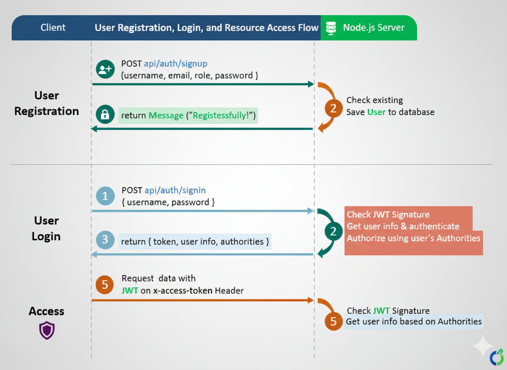
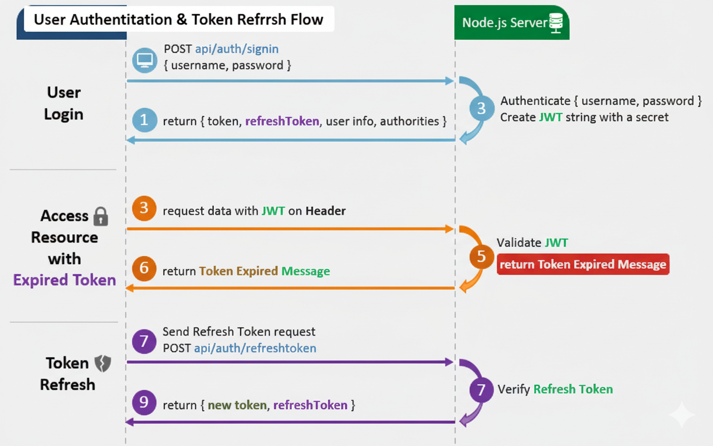

# Node.js MongoDB – User Authentication & Authorization example with JWT & Mongoose

## User Registration, User Login and Authorization process.
The diagram shows flow of how i implement User Registration, User Login and Authorization process.



You may need to implement Refresh Token:



## Project setup
```
npm install
```

### Run
```
node server.js
```
